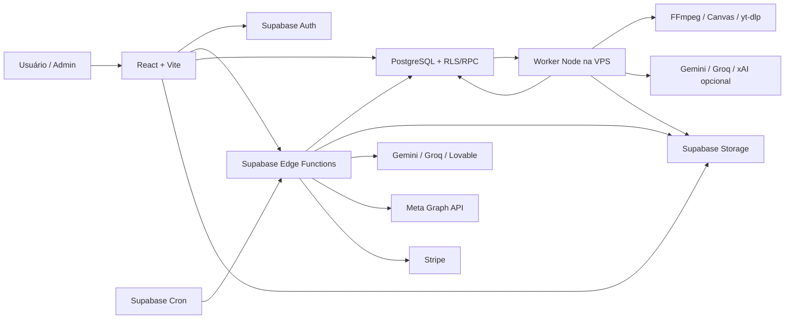
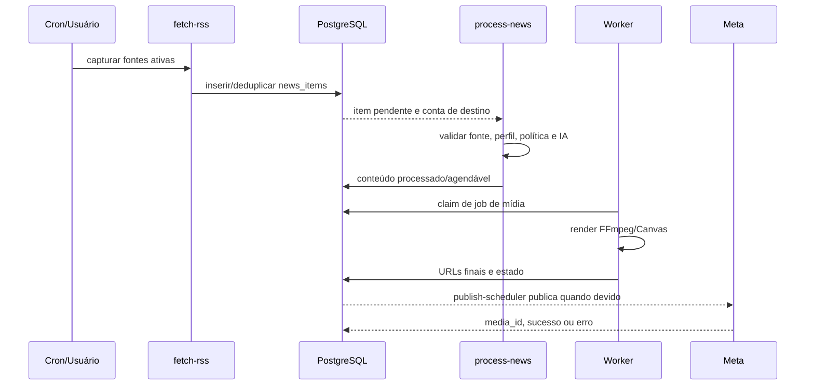
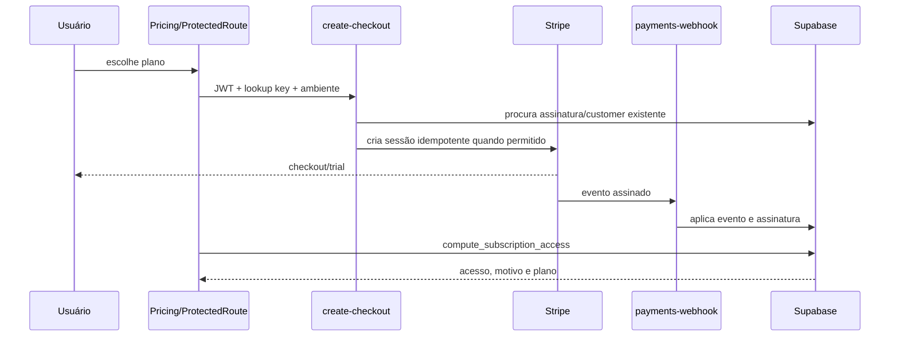

# Arquitetura — Flux & Feed

Atualizado em **2026-08-01** a partir da `main` em `c0106d3`.

## Arquitetura geral

O frontend coordena a experiência e ações autenticadas. Edge Functions concentram integrações e regras server-side. O banco mantém estado, isolamento, cobrança e filas. O worker executa tarefas pesadas que não cabem no ambiente ou duração de Edge Functions.

## Módulos

### Frontend — `src/`

- `pages/`: site público, autenticação, dashboard, configurações e administração;
- `components/`: UI, modais, previews, editor, pricing e componentes de negócio;
- `components/editorial-pilot/`: preview da proposta editorial;
- `config/`: feature flags e rollout;
- `contexts/`: autenticação, idioma e estado transversal;
- `integrations/supabase/`: cliente e tipos do banco;
- `lib/`: Stripe, políticas, contratos, roteamento, formatação e utilitários;
- `lib/subscriptionAccess.ts`: classificação pura e fail-closed do resultado de acesso;
- `lib/editorial-pilot/`: schema e construção determinística da proposta;
- `test/`: regressões, contratos, segurança e operação.

Rotas públicas cobrem autenticação, verificação/recuperação, preços, checkout, termos, privacidade, exclusão de dados e OAuth. Rotas protegidas cobrem notícias, fontes, pautas, Perfil de Criador, agendados, contas, templates, canais, insights, cortes, suporte e administração.

### Edge Functions — `supabase/functions/`

#### Conteúdo e IA

- `process-news`: processamento editorial de notícias;
- `generate-from-prompt` e `generate-from-topic`: conteúdo avulso/perene;
- `extract-from-youtube` e `extract-topics-from-pdf`: extração de material;
- `discover-rss`, `preview-source`, `fetch-rss` e `retry-failed-news`.

#### Automação e publicação

- `autopilot`: reposição e roteamento por conta;
- `publish-scheduler`: seleção e publicação de itens devidos;
- `fetch-insights`: métricas;
- `keep-ig-token-alive`, `refresh-ig-token` e `verify-ig-token`.

#### Instagram/Meta

- `instagram-oauth-start` e `instagram-oauth-callback`;
- `instagram-manual-connect`;
- `instagram-deauthorize` e `instagram-data-deletion`;
- `meta-usage-refresh`.

#### Pagamentos

- `create-checkout`;
- `create-portal-session`;
- `payments-webhook` e `payments-reconcile`;
- `admin-sync-stripe-price`.

#### Administração e comunicação

- campanhas/e-mail, verificação, impersonação e suporte;
- `mcp` e rotas administrativas de diagnóstico.

#### Compartilhados

`supabase/functions/_shared/` concentra autenticação, autorização, Stripe, perfil, política editorial, integridade de legendas, configurações conta/canal, roteamento de mídia, templates, observabilidade, captura, timezone e contratos de carrossel.

Regras usadas por mais de um consumidor devem ficar em módulos compartilhados para reduzir divergência entre UI, Edge Functions e worker.

### Worker — `worker/`

Responsabilidades:

- consumir jobs no banco;
- renderizar arte, carrossel e vídeo;
- executar FFmpeg/ffprobe e yt-dlp;
- usar `@napi-rs/canvas` para layouts;
- gerar Reels, cortes, legendas e overlays;
- selecionar/carregar imagens temáticas;
- reutilizar artefatos quando seguro;
- armazenar arquivos finais;
- fazer retry e registrar saúde/capacidades.

`worker/aiProviders.js` ordena provedores de transcrição e análise. Groq/Gemini cobrem transcrição; Gemini e xAI opcional cobrem análise estruturada. OpenRouter ainda não está implementado.

## Organização e padrões

### Separação de responsabilidades

- UI não recebe secrets nem decide autorização administrativa;
- Edge Functions validam JWT, origem, payload e permissão;
- RPCs encapsulam decisões atômicas de acesso e cobrança;
- banco/funções de claim protegem filas e webhooks;
- worker executa processamento pesado e idempotente;
- contratos compartilhados evitam formatos divergentes.

### Isolamento por Instagram

`instagram_account_id` é a fronteira editorial. Consultas e escritas específicas de conta devem ser filtradas por usuário e conta. Configurações globais são defaults; conta e canal têm precedência. Fontes podem ser compartilhadas, mas seus vínculos explícitos controlam o roteamento.

### Fail-closed

Autorização, Stripe, contratos de IA, feature flags, limites e deploy não usam defaults permissivos. Em dúvida, a ação sensível para e retorna erro sanitizado.

### Idempotência

- webhooks registram eventos, claims e efeitos;
- checkout usa chaves de idempotência e detecta assinatura existente;
- worker e filas registram estado/tentativa;
- deduplicação editorial usa chaves e janelas duráveis;
- deploys usam SHA aprovado, estado durável, backup, gates e rollback.

### Feature flags

Flags começam desligadas no contrato padrão. `VITE_FEATURE_EDITORIAL_PILOT_PREVIEW` está `false` em `.env.example` e habilitado no arquivo de desenvolvimento rastreado. Isso não comprova nem autoriza ativação em produção.

## Fluxos de dados

### Captura e processamento de notícia

### Autopiloto

1. cron invoca `autopilot`;
2. assinatura, aprovação e contas ativas são avaliadas;
3. configurações global/conta/canal são resolvidas;
4. cada Instagram é processado isoladamente;
5. fila vazia recebe conteúdo preparado imediatamente;
6. `scheduled_for` respeita intervalo e horário;
7. limite diário soma formatos por conta;
8. falha de uma conta não aborta as demais.

### Pagamento e acesso

Uma assinatura manual/Pix não exige cartão nem customer Stripe. Ela deve satisfazer ambiente, plano pago, status, aprovação, e-mail, vigência e ausência de congelamento/reembolso. Na branch de correção do PR rascunho #42, somente `has_access=true` ou o bypass administrativo libera conteúdo; falha de RPC e demais motivos são apresentados separadamente, sem sugerir cartão indevidamente. Essa arquitetura ainda não está na `main` nem no frontend publicado.

### Cortes de vídeo

1. URL ou arquivo cria job;
2. captura/transcrição produz timestamps;
3. análise retorna intervalos estruturados;
4. worker valida e executa FFmpeg;
5. Canvas, legenda e branding são aplicados;
6. Storage recebe os arquivos finais;
7. UI permite revisão, rerender e publicação.

### Piloto Editorial

1. UI seleciona conta e lê o Perfil de Criador;
2. builder local normaliza dados e classifica o domínio;
3. proposta `editorial-pilot/v1` recebe fingerprint da conta/perfil;
4. Zod valida contrato estrito, referências e percentuais;
5. UI exibe estratégia, fontes, pautas, cadência e guardrails;
6. nenhuma mutação de banco ou publicação é feita.

## APIs e contratos

### Edge Functions

Algumas funções usam `verify_jwt=false` no `config.toml` porque validam internamente JWT, assinatura de webhook ou secret de cron. Isso não significa endpoint desprotegido.

Regras:

- validar método, origem, JWT e corpo;
- nunca confiar em `user_id` enviado pelo frontend;
- sanitizar stack, token, e-mail e payload sensível;
- distinguir autenticação, permissão, validação e falha externa;
- exigir permissão explícita em funções administrativas.

### Contratos de IA

Entradas carregam fonte, conta, perfil e tarefa. Saídas críticas usam JSON estruturado e validação antes de avançar. Carrossel valida slides e imagens; Piloto Editorial valida `editorial-pilot/v1`; análise de cortes deve retornar timestamps válidos.

## Banco de dados

A `main` contém 177 migrations versionadas. Domínios representativos:

| Domínio | Tabelas/contratos representativos |
|---|---|
| Identidade | `profiles`, `instagram_accounts`, `creator_profiles`, brand kits |
| Configuração | `user_settings`, `account_settings`, `channel_settings`, assignments |
| Conteúdo | `news_sources`, vínculos de fontes, `news_items`, `content_topics`, `scheduled_posts` |
| Observabilidade | logs, fetch runs, worker health, uso Meta/IA |
| Pagamentos | `plan_limits`, `user_subscriptions`, eventos/efeitos/reconciliação |
| Cortes | jobs, clips, perfis, rerender e uso diário |
| Operação | releases, permissões, suporte, e-mail e despesas |

Migrations são append-only. Presença no Git não comprova aplicação no banco; produção deve ser auditada por histórico e existência de tabelas, colunas e RPCs.

## Autenticação e segurança

- Supabase Auth é a identidade primária;
- frontend usa publishable/anon key;
- service role existe apenas em Edge Functions e worker;
- RLS e RPCs protegem dados por usuário;
- funções administrativas validam JWT e permissão;
- tokens Instagram e secrets passam por rotas controladas;
- webhook Stripe valida assinatura;
- redirects usam allowlist;
- logs são sanitizados;
- `check:secrets` bloqueia credenciais indevidas.

## Integrações

### Meta Instagram

OAuth, conexão manual, publicação, refresh/health de token, insights e uso de API. O destino da conta é obrigatório. Música nativa/licenciada não deve ser tratada como arquivo livre sem validar API e direitos.

### Stripe

Creator, Pro e Business usam lookup keys; Agência usa contato comercial. O ambiente deriva da chave publicável. Checkout reutiliza customer quando possível e bloqueia duplicidade. O catálogo live e o estado de assinaturas permanecem itens de auditoria externa.

### Provedores de IA

- Gemini: texto, vídeo, análise e fallback de transcrição;
- Groq: texto e Whisper/transcrição;
- Lovable: gateway em fluxos existentes;
- xAI/Grok: análise opcional de cortes no worker;
- OpenRouter: backlog, ainda ausente.

### VPS e deploy

PM2 mantém processos de webhook, mídia e cortes. Deploy usa fila durável, SHAs aprovados, health checks e rollback. Estado interrompido deve ser reconciliado pelos scripts versionados; nunca editar arquivos operacionais manualmente.

## Decisões técnicas

| Decisão | Motivo |
|---|---|
| Supabase como núcleo | Auth, Postgres, Storage, cron e funções integrados |
| Worker externo | binários, duração e memória de mídia |
| Configuração por Instagram | impedir mistura editorial e permitir múltiplas marcas |
| Carrossel transportado como Feed | contrato técnico da Meta com múltiplas mídias |
| Contratos JSON estritos | impedir avanço de resposta de IA inválida |
| Fallback de IA | reduzir indisponibilidade de provedor único |
| Feature flag | ativação e rollback graduais |
| Stripe lookup keys | desacoplar UI de IDs de preço |
| Logs sanitizados | observabilidade sem exposição de dados |
| Docs raiz obrigatórios | continuidade sem depender de chats |

## Melhorias futuras

1. Auditar drift Git ↔ frontend ↔ Edge ↔ banco ↔ VPS.
2. Aplicar o Piloto por diff transacional e aprovação item a item.
3. Centralizar ainda mais provedores, orçamento e telemetria.
4. Medir repetição e relevância/licença de imagens.
5. Adicionar tracing por request e conta com identificadores sanitizados.
6. Definir SLOs para captura, geração, render e publicação.
7. Expandir E2E de Stripe/Meta em ambientes seguros.

## Disciplina de mudança

Antes de merge/deploy:

1. confirmar branch, SHA e worktree;
2. separar mudanças do usuário;
3. rodar testes proporcionais ao risco;
4. auditar migration, Edge, frontend e worker separadamente;
5. preparar backup e rollback;
6. obter autorização para mutação externa;
7. atualizar os cinco documentos da raiz.
